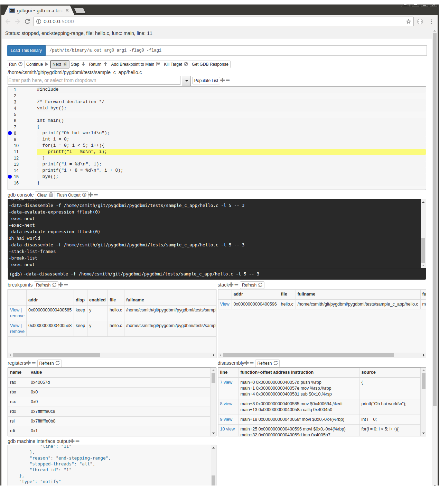

|Build Status| |pypi| |pypi| |Say Thanks!|

A browser-based frontend/gui for GDB
====================================

|gdbgui| A modern, browser-based frontend to gdb (gnu debugger). Add
breakpoints, view stack traces, and more in C, C++, Go, and Rust! Simply
run ``gdbgui`` from the terminal a new tab will open in your browser.

Install
-------

::

    pip install gdbgui --upgrade

Run
---

::

    gdbgui

A new tab in your browser will open with gdbgui in it.

Help
~~~~

``gdbgui -h`` displays command line options, such as changing the port
or host ip. For any other questions feel free to email me or create an
issue in github.

Compatibility
-------------

``gdbgui`` has been tested to work in these environments. It may work in
other environments as well.

Python versions: 2.7, 3.3, 3.4, 3.5, pypy

Operating systems: Ubuntu 16.04

Browsers: Chrome, Firefox, Ubuntu Web Browser

Development
-----------

``gdbgui`` was designed to be easily hackable and extendable. There is
no build system necessary to run or develop this app.

There are only three parts to gdb:

1. ``gdbgui.js``: There is just one JavaScript file, and that file
   contains the majority of the app itself. It sends AJAX requests to
   interact with gdb, then gets the response and updates the DOM as
   necessary.

2. ``gdbgui.jade``: HTML file that defines the frontend (Note: Jade/Pug
   is a more concise form of html. Also note: jade has been renamed to
   `pug <https://github.com/pugjs/pug>`__, but the Python pypi package
   still maintains the jade name. See demo
   `here <http://html2jade.org/>`__.)

3. ``backend.py``: The backend consists of a single Python file, which
   makes use of `pygdbmi <https://github.com/cs01/pygdbmi>`__ to
   interact with a gdb subprocess, and
   `Flask <http://flask.pocoo.org/>`__ to set up url routing and
   responses.

To get started with development, set up a new virtual environment, then
run

::

    git clone https://github.com/cs01/gdbgui
    cd gdbgui
    pip install -r gdbgui/requirements.txt
    python -m gdbgui.backend --debug

Testing
~~~~~~~

``python setup.py test`` runs unit tests located in
``gdbgui/tests/test_app.py``. Add new tests there as necessary.

Contributing
------------

Contributions and bug fixes are welcome!

If you use this at your company or for your job, I would love to hear
from you -- send me an email and let me know.

Possible Improvements
---------------------

-  Add syntax highlighting
-  Hover over a variable and immediately see its value.
-  Assign values to variables / memory addresses
-  Embed a binary/decimal/hex calculator
-  Embed plotting tools to plot a variable's value over time

.. |Build Status| image:: https://travis-ci.org/cs01/gdbgui.svg?branch=master
   :target: https://travis-ci.org/cs01/gdbgui
.. |pypi| image:: https://img.shields.io/badge/pypi-v0.7.2-blue.svg
   :target: https://pypi.python.org/pypi/gdbgui/0.7.1
.. |pypi| image:: https://img.shields.io/badge/python-2.7,%203.3,%203.4,%203.5,%20pypy-blue.svg
   :target: 
.. |Say Thanks!| image:: https://img.shields.io/badge/SayThanks.io-☼-blue.svg
   :target: https://saythanks.io/to/grassfedcode

