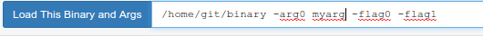
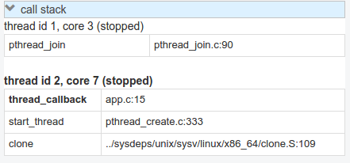
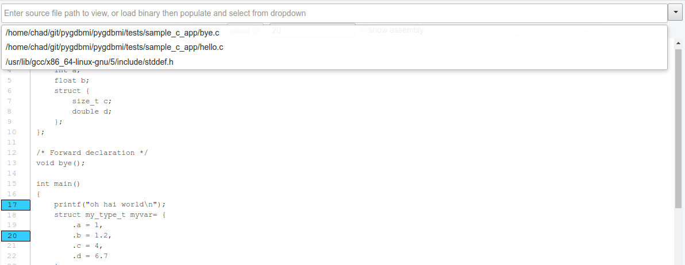
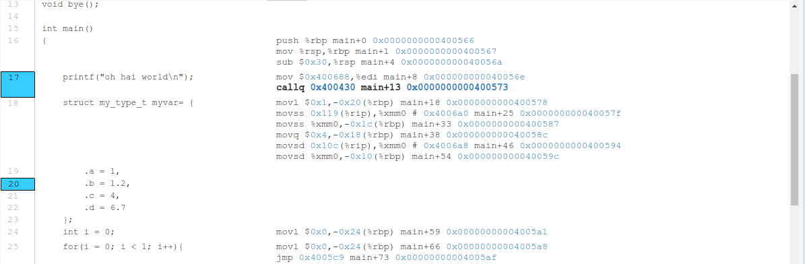
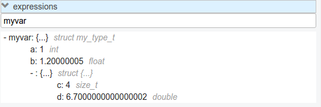
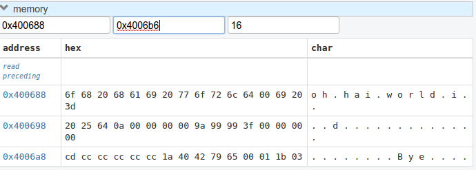
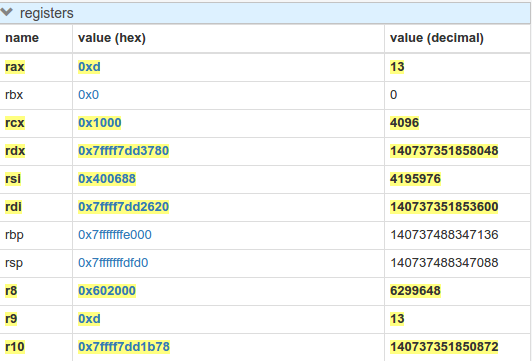
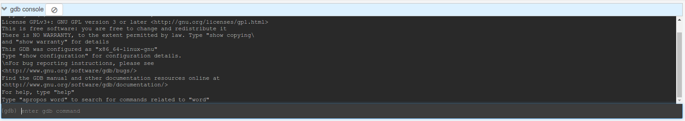

.. gdbgui documentation master file, created by
   sphinx-quickstart on Sun Feb  5 07:59:05 2017.
   You can adapt this file completely to your liking, but it should at least
   contain the root `toctree` directive.

gdbgui - A browser-based frontend/gui for GDB
============================================================

Release v\ |version|

.. image:: https://travis-ci.org/cs01/gdbgui.svg?branch=master
  :target: https://travis-ci.org/cs01/gdbgui

.. image:: https://img.shields.io/badge/pyPI-v0.7.4.2-blue.svg
  :target: https://pypi.python.org/pypi/gdbgui/

.. image:: https://img.shields.io/badge/python-2.7, 3.3, 3.4, 3.5, pypy-blue.svg
  :target: https://pypi.python.org/pypi/gdbgui/

.. image:: https://img.shields.io/badge/SayThanks.io-☼-blue.svg
  :target: https://saythanks.io/to/grassfedcode

.. image:: https://img.shields.io/gratipay/cs01.svg
  :target: https://gratipay.com/cs01/

Mission
------------
1. Make using gdb easier than adding ``printf``'s.
2. Make gdbgui as beautiful as a modern web application should be.

Quickstart
----------
::

    pip install gdbgui
    gdbgui

Features
----------
- Display source code and assembly inline
- Step through source code and assembly
- Visually add and remove breakpoints
- Searchable list of symbols used to create binary
- View and switch frames in stack, and active thread
- Display variables
- Evaluate expressions
- Explore memory
- View all register values
- Full feature gdb console

Screenshots
-----------

Screencast
-----------
A quick capture of gdbgui in use.

.. image:: _static/images/screencast.gif
  :target: _static/images/screencast.gif

Enter the binary and args just as you'd call them on the command line. Binary is restored when gdbgui is opened at a later time.

Intuitive control of your program. From left to right: Run, Continue, Next, Step, Return, Next Instruction, Step Instruction, send interrupt signal (SIGINT) to inferior process.

.. image:: _static/images/controls.png
  :target: _static/images/controls.png

Stack/Threads
-----------
View all threads, the full stack on the active thread, the current frame on inactive threads. Switch between frames on the stack, or threads by pointing and clicking.

Source Code
-----------
View source, assembly, add breakpoints. All symbols used to compile the target are listed in a dropdown above the source code viewer, and have autocompletion capabilities.

Variables and Expressions
-----------

.. image:: _static/images/locals.png
  :target: _static/images/locals.png

All variables and their values are displayed each time gdb pauses. Arbitrary expressions can be evaluated as well.

Memory Viewer
-----------
All hex addresses are automatically converted to clickable links to explore memory. Length of memory is configurable. In this case 16 bytes are displayed per row.

Registers
-----------
View all registers. If a register was updated it is highlighted in yellow.

gdb console
-----------
Read gdb output, and write to the gdb subprocess as desired. Don't let any gdb commandline skills you've developed go to waste.

gdbgui at launch:

.. image:: _static/images/ready.png
  :target: _static/images/ready.png

.. raw:: html

    <embed>
      
    </embed>
